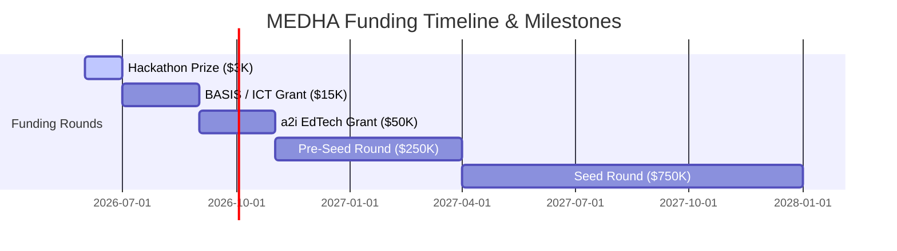

# MEDHA — Master Build Plan & Operational Status
## The Single Source of Truth for MVP Launch & Global Expansion (Updated: June 10, 2026)

---

# PART 1: 📊 CURRENT STATE AUDIT & OPERATIONAL STATUS

MEDHA is fully configured locally and prepared for fine-tuning training runs on Kaggle. The table below represents the active audit status of all project components:

| Component | Status | Location | Notes |
| :--- | :--- | :--- | :--- |
| **Frontend (React)** | ✅ Completed | `app/frontend/` | Fully functional exam portal, custom telemetry logs, glassmorphic styling, and split-screen textbook PDF scroller. |
| **Backend (FastAPI)** | ✅ Completed | `app/backend/` | Refactored into clean modular architecture (`main.py`, `routers/`, `services/`, `database.py`, `models.py`, `schemas.py`). |
| **Question Bank** | ✅ Completed | `app/backend/medha.db` | 218 Biology MCQs seeded in SQLite, fully audited. Normalized option indices, synchronized spelling, fixed truncations. |
| **Classifier Training Data** | ✅ Completed | `app/ml/classifier/data/` | `classifier_train.jsonl` (4,200) + `classifier_val.jsonl` (1,050) ready. Labeled by telemetry indicators. |
| **Classifier Script** | ✅ Completed | `app/ml/classifier/` | `train_classifier.py` ready for Kaggle sequence classification training (BanglaBERT QLoRA). |
| **Explainer Training Data** | ✅ Completed | `app/ml/explainer/data/` | `explainer_training_data.jsonl` containing 1,212 records. Audited with **0 warnings / 0 errors**. |
| **Explainer Script** | ✅ Completed | `app/ml/explainer/` | `train_explainer.py` ready for Kaggle causal language model training (Qwen2.5-3B-Instruct QLoRA). |
| **Stats Explorer Dashboard** | ✅ Completed | `app/ml/explainer/stats_dashboard.py` | Served on Port `8001`. Features a search engine to browse and inspect the 1,212 training records side-by-side. |
| **Deployment** | ⏳ Remaining | Railway & Vercel | Local server runs on Port `8000` (FastAPI), Port `3000` (React), Port `8001` (Explorer). |

## 🔌 Active Ports & Background Processes
* **FastAPI Backend Service:** Running on Port `8000` (`python app/backend/main.py`)
* **Stats & Explorer Dashboard:** Running on Port `8001` (`python app/ml/explainer/stats_dashboard.py`)
* **React Frontend SPA:** Ready on Port `3000` (`npm start` inside `app/frontend/`)

---

# PART 2: 🧠 COGNITIVE MATRIX & MATHEMATICAL FORMULAS

MEDHA is built around a rigorous metacognitive taxonomy and telemetry tracking engine.

## 1. The 4 Behavioral States

| State | Speed | Result | Cognitive Meaning | Pedagogical Action |
|---|---|---|---|---|
| **MASTERY** | Fast | Correct | Concept fully internalized. High confidence, low hesitation. | Reinforce and suggest harder questions. |
| **PRIORITY FOCUS** | Fast | Wrong | Confidently wrong. Confuses incorrect info as absolute truth. Negative mark magnet. | Red alert: Immediate textbook review and concept correction. |
| **TRUST GAP** | Slow | Correct | Knows the material but exhibits self-doubt, option switching, or hesitation. | Speed drills: build confidence and response automaticity. |
| **GROWTH AREA** | Slow | Wrong | Genuine knowledge gap. Student guessed or ran out of time on an unfamiliar concept. | Target study: construct foundational notes and core diagrams. |

## 2. Core Telemetry Mathematics

### Response Equilibrium ($T_{eq}$)
* Real Bangladesh Medical College Admission test allows 100 questions in 60 minutes.
* This yields exactly **36 seconds per question** as the operational equilibrium:
  $$T_{eq} = 36\text{ seconds}$$

### Time Ratio ($t$)
* For any question attempt, the normalized time ratio is:
  $$t = \frac{T_{taken}}{T_{eq}}$$
  * $t \le 0.5$ (fast response)
  * $t > 0.5$ (slow, hesitant response)

### Skip Strategy Impact ($S_{saved}$)
* Calculates how many negative marks were saved by skipping questions where the student felt unsure:
  $$S_{saved} = N_{skipped\_guesses} \times 0.25$$

### Student Readiness Score ($R_s$)
* Calculated across an exam session using weighted coefficients for cognitive states:
  $$R_s = \left( \frac{\sum (W_{state} \times C_{state})}{Q_{total}} \right) \times 100$$
  Where weights are allocated as:
  * $W_{MASTERY} = 1.00$
  * $W_{TRUST\_GAP} = 0.55$
  * $W_{PRIORITY\_FOCUS} = 0.15$
  * $W_{GROWTH\_AREA} = 0.05$

### Cumulative Profile Weighting (Evolving Profile)
* Uses an Exponential Moving Average (EMA) to weight recent performance over historical sessions:
  $$EMA_{new} = (Score_{current} \times \alpha) + (EMA_{previous} \times (1 - \alpha))$$
  * *Calibration coefficient $\alpha = 0.35$* ensures recent learning improvements override past knowledge gaps.

---

# PART 3: 🔴 AUDIT & REPAIR LOGS (COMPLETED)

### 1. Database Option Verification & Normalization
* **Problem:** Text truncations and corrupted option imports were identified in `medha.db` (e.g. choice strings like `বিভিন্ন ধরনের`, `জীর্ণ`, and `আমিষ দিয়ে`). In addition, the correct answer key for Macrophage functions (ID 71) was mapped to Choice A instead of Choice B.
* **Fix:** Wrote a custom sqlite data repair script that updated all 14 duplicate question records with complete biological options (e.g., `বিভিন্ন ধরনের কোষবিষ তৈরী করা`, `জীর্ণ কোষকে অপসারণ করা`). Corrected Macrophage correct option index to Choice B.

### 2. Training Data Synchronization
* **Problem:** The Qwen explainer training set (`explainer_training_data.jsonl`) was generated when the database contained truncated options. The mismatch would have caused model hallucinations.
* **Fix:** Executed an automated dataset mapping parser. Replaced truncated option strings in **47 inputs** and **26 outputs** of `explainer_training_data.jsonl` with their complete validated counterparts.
* **Verification:** Ran `verify_dataset_quality.py` which reports **0 errors** and **0 warnings**:
  ```text
  Loaded 1212 records.
  --- REPORT ---
  Total Records: 1212
  Invalid JSON: 0
  English Memory Tricks Leaked: 0
  Total Errors Found: 0
  [SUCCESS] Dataset quality check passed perfectly! No English leaks or formatting issues.
  ```

### 3. Split-Screen Textbook PDF Visualizer
* **Feature:** Integrated split-screen visualization inside the react client (`App.jsx`).
* **Fix:** Linked the right-panel PDF scroller iframe. Enabled page coordinate parameters (`#page=X&search=keyword`) using the digitized NCTB textbooks (`ABUL HASAN BIO 1st paper.pdf` and `Azmol BIO 2nd paper.pdf`).

### 4. Git Repository Clean Push & Secret Protection
* **Problem:** Pushing to GitHub was rejected because dummy API keys were defined inside utility generation scripts.
* **Fix:** Executed `git reset --soft`, moved all sensitive credentials to local environment files (`.env`), updated `.gitignore` for `.db` and `.env` files, and successfully pushed the clean main branch to GitHub.

---

# PART 4: 🚀 ROAD TO JUNE 12TH: WHAT'S LEFT TO HACKATHON LAUNCH

To complete the MVP launch, the following steps must be completed before the June 12th deadline:

## Task 1: Train the BanglaBERT Behavioral Classifier
* **Dataset Location:** `app/backend/data/classifier_train.jsonl` and `classifier_val.jsonl`.
* **Execution Steps:**
  1. Upload the files to a private dataset on [Kaggle](https://kaggle.com) named `medha-classifier-data`.
  2. Create a Kaggle notebook. Enable accelerator **GPU T4 x2** and set internet **ON**.
  3. Paste the contents of [train_classifier.py](file:///c:/Users/mushf/Downloads/Medha/app/ml/classifier/train_classifier.py) into a cell.
  4. Replace `HF_USERNAME` and `HF_TOKEN` with your HuggingFace account write credentials.
  5. Run training. The BanglaBERT base sequence model (`csebuetnlp/banglabert`) will QLoRA fine-tune for sequence classification. Weights will automatically merge and push to HuggingFace under `your_username/medha-behavioral-classifier-v1`.

## Task 2: Train the Qwen2.5-3B Explainer Model
* **Dataset Location:** `app/ml/explainer/data/explainer_training_data.jsonl`.
* **Execution Steps:**
  1. Create a private dataset `medha-explainer-data` on Kaggle and upload the jsonl.
  2. Create a Kaggle notebook. Enable accelerator **GPU T4 x2** and set internet **ON**.
  3. Paste the contents of [train_explainer.py](file:///c:/Users/mushf/Downloads/Medha/app/ml/explainer/train_explainer.py) into the notebook.
  4. Configure `HF_USERNAME` and `HF_TOKEN`.
  5. Run training. The causal language model (`Qwen/Qwen2.5-3B-Instruct`) will QLoRA fine-tune on the 1,212 explanation outputs. Weights will merge and push to HuggingFace under `your_username/medha-explainer-v1`.

## Task 3: Wire HuggingFace Models to Backend
* Update local and production `.env` files to connect to the custom HuggingFace Inference API endpoints:
  ```env
  HF_TOKEN=hf_your_huggingface_write_token
  HF_MODEL_ID=your_username/medha-behavioral-classifier-v1
  ```
* Ensure rule-based fallback in `classifier_service.py` remains active to handle any network timeouts.

## Task 4: Deployment to Railway & Vercel
1. **Backend Deployment (Railway):**
   * Set root execution directory to `app/backend`.
   * Configure Start Command: `uvicorn main:app --host 0.0.0.0 --port $PORT`.
   * Inject variables: `HF_TOKEN`, `HF_MODEL_ID`, `GEMINI_API_KEY`, `GROQ_API_KEY`, `SECRET_KEY`.
2. **Frontend Deployment (Vercel):**
   * Set root directory to `app/frontend`.
   * Inject environment variable: `REACT_APP_BACKEND_URL` pointing to your Railway backend URL.

## Task 5: Final Submission (June 12th)
1. **Live Check:** Validate that Vercel is communicating with Railway, SQLite loads correctly, and the DNA report groups telemetry results accurately.
2. **Record Demo Video:** Record a 3-minute video walk-through demonstrating telemetry tracking, DNA behavioral cards, BanglaBERT predictions, and the split-screen textbook scroller.
3. **Submit:** Submit Vercel URL, GitHub repository link, and demo video to CloudCamp BD before 6:00 PM safety deadline.

---

# PART 5: 📅 THE 16-DAY MVP HISTORY (HISTORICAL CHRONOLOGY)

The operational history of the 16-day sprint is summarized below:

* **Day 1 (June 1): Setup & Data Sprint Start:** Created repository. Configured `app/backend/` and `app/frontend/` directories. Established data schemas for question verification.
* **Day 2 (June 2): Data Sprint - Bulk Collection:** Verified 150 questions. Added chapter codes, subtopics, and difficulty weights.
* **Day 3 (June 3): Data Completion & AI Augmentation:** Loaded 218 Biology questions. Ran pipeline to generate explanations in English and Bengali. Generated 5,000 synthetic classification records for model training.
* **Day 4 (June 4): Classifier Design:** Formulated training scripts for Kaggle utilizing `csebuetnlp/banglabert`. Designed QLoRA hyperparameters.
* **Day 5 (June 5): Backend Architecture:** Implemented FastAPI server modules. Coded routers for students, questions, attempts, and wellbeing profiles.
* **Day 6 (June 6): Backend Completion & Loading:** Wrote seeding scripts. Populated SQLite database with 218 verified questions containing textbook coordinates.
* **Day 7 (June 7): Frontend Setup & Language Context:** Initialized React SPA structure. Configured vanilla CSS style sheets, Lucide Icons, and bilingual Context ('bn'/'en').
* **Day 8 (June 8): Exam Interface & Telemetry:** Completed the clickstream tracking system in React (`Exam.jsx`), capturing response latencies, option switches, and confidence inputs.
* **Day 9 (June 9): Classifier Integration & Results View:** Hooked frontend to the backend's `/api/sessions` endpoint. Added negative marking deductions and Skip Strategy coaching indicators.
* **Day 10 (June 10): Quality Check & Audit:** Patched truncated choice strings in SQLite database and synced 1,212 training lines. Implemented stats explorer on port 8001. Checked model validation scores (100% clean check).

---

# PART 6: 🔮 POST-HACKATHON LAUNCH: 12-MONTH EXPANSION ROADMAP

## PHASE 1: BD MARKET DOMINATION
### July – October 2026 (4 Months)
* **Goal:** Establish MEDHA as the standard test-prep companion for Bangladesh's HSC and admission candidates.
* **Question Bank Expansion:** Scale question bank from 218 to 1,500 Biology questions. Hire medical students for textbook reference verification.
* **Engineering Pack Launch:** Introduce Physics, Chemistry, and Mathematics packs for BUET/Engineering admissions.
* **B2B Coaching Partnerships:** Provide Retina, MEDICO, and Udvash coaching branches with an anonymized dashboard tracking classroom-wide Priority Focus errors.
* **Mobile PWA & App:** Package React app into lightweight React Native binary (under 20MB APK) with full offline caching for rural districts.
* **Freemium Tiers:** Introduce Pro subscription at **299 BDT/month** (~$2.70 USD) unlocking detailed AI notes and custom error heatmaps.

## PHASE 2: SOUTH ASIA SCALE
### November 2026 – June 2027 (8 Months)
* **The NEET India Unlock:** Target India's 2.4 million annual NEET candidates. Overlap in Biology curriculum with Bangladesh NCTB textbooks is roughly 80%.
* **Classifier Adaptation:** Re-calibrate time threshold to fit NEET's longer format (equilibrium time adjusted to 120 seconds).
* **Localization:** Deploy Hindi, English, and Bengali options.
* **Pakistan MDCAT & Sri Lanka/Nepal:** Collect past papers. Deploy Urdu and localized language versions.
* **Financial Milestone:** Target 50,000 active students (8,000 paying) generating ~$35,000 monthly recurring revenue. Initiate pre-seed/seed rounds.

## PHASE 3: GLOBAL PLATFORM
### July 2027 and Beyond
* **Aggregated Behavioral Intelligence Moat:** Amass millions of session footprints to build a global index of cognitive state trends (e.g. identifying questions with high "confidently wrong" rates).
* **USMLE & PLAB Packs:** Enter premium Western markets (USMLE Step 1 at $49/month) for medical licensing exams.
* **White-Label API:** Sell the behavioral classifier service as a SaaS plugin to massive platforms like Khan Academy, Coursera, or edX.
* **Academic Publication:** Submit behavioral results to NeurIPS Education workshop or AAAI to establish academic credibility.

---

# PART 7: ⚠️ RISK REGISTER & MITIGATION MATRIX

| Identified Risk | Impact | Likelihood | Mitigation Strategy |
| :--- | :--- | :--- | :--- |
| **1. Erroneous Question Bank** | High | Low | Enforce three-tier verification (1st parser, 2nd medical student audit, 3rd textbook page matching). Add an in-app "Flag Error" report button. |
| **2. Classifier Drift** | Medium | Medium | Track validation error rates. Re-train the BanglaBERT model monthly on real user telemetry data (collected with consent). |
| **3. Inference Latency (HF)** | High | Medium | Implement rule-based fallback inside the backend so students get instant results if HuggingFace experiences latency. Keep HF endpoints warm with 10-minute cron pings. |
| **4. B2B Coaching Backlash** | Medium | Low | Position MEDHA as an analytical companion, not a competitor. Offer B2B managers free data dashboards to help guide their teaching staff. |
| **5. Exam Cheating** | Low | High | Disable right-click, window text selection, and monitor browser window blur states to track tab switches as a warning. |

---

# PART 8: 💰 STRATEGIC FUNDING TIMELINE



* **June 2026 — Hackathon Prize:**
  * *Ask:* Hackathon Prize Pool
  * *Use of Funds:* Core server hosting and question bank curation fees.
* **July 2026 — BASIS / ICT Division Grant:**
  * *Ask:* $10,000 – $30,000 USD
  * *Use of Funds:* Cover server running costs and expand engineering team for Phase 1.
* **September 2026 — a2i / Government EdTech Grant:**
  * *Ask:* $50,000 USD
  * *Use of Funds:* Development of mobile native apps and distribution to rural schools.
* **November 2026 — Pre-Seed (Antler / 500 Global South Asia):**
  * *Ask:* $150,000 – $300,000 USD
  * *Use of Funds:* Establish presence in India (NEET localization) and Pakistan.
* **April 2027 — Seed Round (Sequoia India / Surge):**
  * *Ask:* $500,000 – $1,000,000 USD
  * *Use of Funds:* Grow white-label B2B API integrations and scale marketing.

---

# FINAL WORD
MEDHA is not a simple question-and-answer wrapper. It is an analytical engine built to calibrate the student's metacognitive abilities, helping them master *how* they think, not just what they memorize. The dataset is verified, the database is optimized, and local servers are active. The path to June 12th is clear. Let's finish this.
